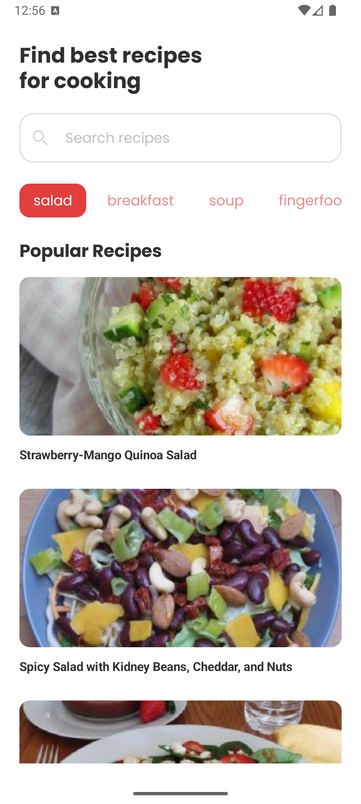
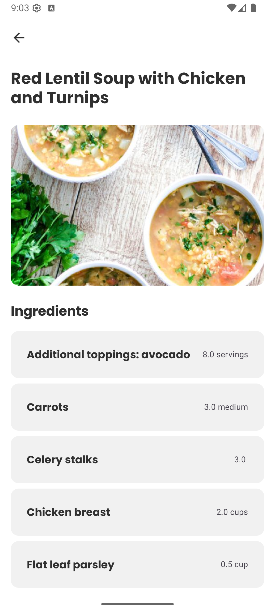

# CookFlow

CookFlow is a simple Android application that helps users discover recipes based on category or name.  
It fetches data from the [Spoonacular API](https://spoonacular.com/food-api) and provides details such as instructions and ingredients.  

## Features (planned)
- Search recipes by **category** or **name**
- Display results as cards
- View detailed recipe information:
  - Step-by-step instructions  
  - List of ingredients  

## Tech Stack
- **Kotlin** – main programming language  
- **Jetpack Compose** – declarative UI  
- **Coil** – image loading  
- **Retrofit** – networking  
- **Hilt** – dependency injection  
- **Room** – local data persistence  

## API
This app integrates with the [Spoonacular API](https://spoonacular.com/food-api) for recipe data.

## Screenshots

<table>
  <tr>
    <td></td>
    <td></td>
  </tr>
</table>

## Project Status
The project is currently a work in progress.
